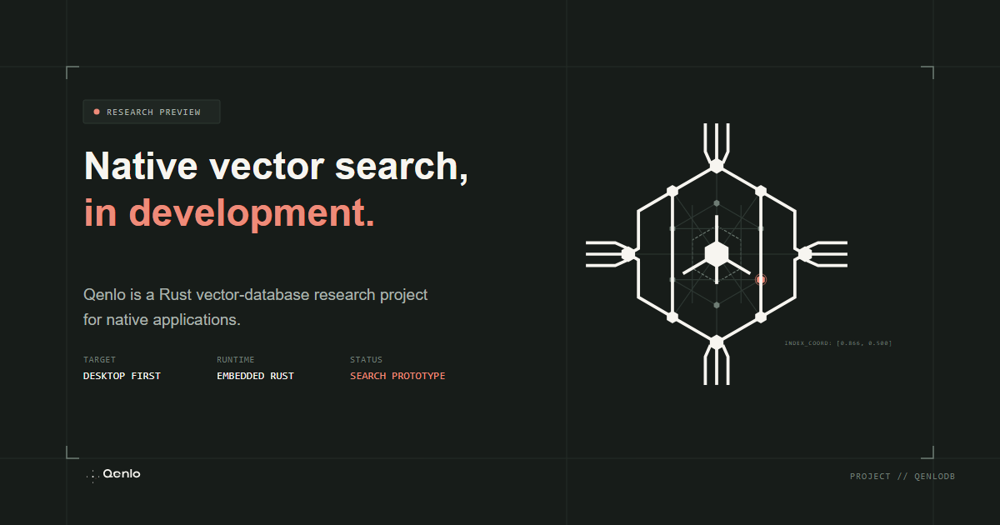

<p align="center">
  
</p>

<p align="center">
  <strong>embedded filtered vector search, measured before it is marketed.</strong>
</p>

<p align="center">
  <a href="#the-question">the question</a> ·
  <a href="#whats-in-here">what's in here</a> ·
  <a href="#get-running">get running</a> ·
  <a href="#research-status">research status</a>
</p>



## the question

Filtered vector search is often described as a database problem long before
anyone measures the work a real query does. Qenlo starts with the measurement.

It is a Rust research prototype for native applications that embed dense-vector
search directly in the client. The engine indexes pre-computed embeddings; it
does not generate them, transform tensors, or run neural inference. Those
belong to the runtime that produced the vectors.

The current bet is narrow: on a repeatable **1m × 768**, **1%-eligible**,
**batch-1**, **k=10** workload, can an exact GPU path beat the strongest
qualifying CPU path by **2× at P95** without giving up recall or correct
filtering? Until that run exists, GPU acceleration is an experiment, not a
claim.

## what’s in here

| crate | responsibility |
| --- | --- |
| [`qenlo-core`](crates/qenlo-core) | canonical records, metadata predicates and indexes, normalized vectors, exact cosine search |
| [`qenlo`](crates/qenlo) | async embedded collection API, execution reports, optional USearch and `wgpu` backends |
| [`qenlo-bench`](crates/qenlo-bench) | independent correctness oracle, benchmark support, and OTLP example |

The baseline is deliberately plain: portable, exact CPU search with no C++ or
GPU build requirement. Optional backends are explicit because a feature flag
should tell the truth about the toolchain it brings along.

| path | algorithm | filter execution | intent |
| --- | --- | --- | --- |
| CPU (default) | exact cosine | ordered metadata indexes | correctness baseline |
| `usearch` | HNSW | graph predicate | approximate comparison |
| `gpu-wgpu` | exact cosine | CPU mask, eligible rows, or GPU predicate | acceleration research |

Every search returns an `ExecutionReport`: requested and actual backend,
algorithm, filtering path, rebuild state, phase timings, transfer sizes, and a
fallback reason where one exists. That is there so a fast-looking result has to
explain itself.

## get running

You need the Rust toolchain declared in
[`rust-toolchain.toml`](rust-toolchain.toml). Then clone the repository and run
the portable suite:

```powershell
git clone https://github.com/a3ro-dev/qenlo.git
cd qenlo
cargo test --workspace --no-default-features
```

Build the optional paths only when you are ready for their dependencies:

```powershell
# wgpu exact-search path
cargo test -p qenlo --features gpu-wgpu

# USearch / C++ path
cargo test -p qenlo --features usearch

# benchmark crate and OTLP example
cargo check -p qenlo-bench --all-features --examples
```

On the target Windows laptop, MSVC 14.29 currently crashes in USearch's
`numkong` dependency. `clang-cl` is a verified local workaround while the C++
Build Tools installation is repaired:

```powershell
$env:CC = 'clang-cl'
$env:CXX = 'clang-cl'
cargo test -p qenlo --features usearch
```

This is intentionally not forced through workspace configuration. Downstream
users and non-Windows targets keep their own native toolchain.

## research status

| area | current state |
| --- | --- |
| exact CPU search and metadata filtering | implemented and tested |
| USearch filtered ANN path | implemented; local Windows toolchain workaround documented |
| `wgpu` device smoke tests | implemented and tested |
| dataset preparation and competitor benchmarks | not yet run |
| 2× P95 gate | not yet evaluated |
| native runtime acceptance | Windows DX12/Vulkan; other platforms untested |

The library emits tracing spans and never installs a global subscriber. The
application owns its tracing and export setup; the OTLP HTTP/protobuf example
lives in `qenlo-bench`.

## project boundaries

This is early research, not a production-ready database. The public API, broad
platform support, and performance conclusions are still being earned. If you
use the prototype, treat the exact CPU path and its correctness checks as the
ground truth, then make every faster path prove it deserves to stay.

## license

Qenlo is available under either the [MIT License](LICENSE-MIT) or
Apache-2.0, at your option.
