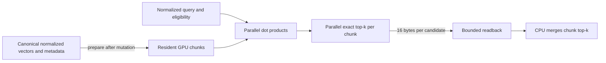

# How Qenlo's GPU search works

The GPU implementation is a custom exact cosine-search kernel in
[`gpu_exact.wgsl`](../crates/qenlo/src/gpu_exact.wgsl), driven by
[`gpu.rs`](../crates/qenlo/src/gpu.rs). wgpu supplies device access, buffer
management, shader compilation and synchronization. It does not supply a vector
index or nearest-neighbor algorithm. USearch is a separate, externally supplied
CPU HNSW implementation; its graph does not run on the GPU.

## From vectors to results

For normalized vectors, cosine distance is `1 - dot(query, vector)`. The score
kernel uses 32 adjacent threads per vector so adjacent threads read adjacent
dimensions. Eight vectors share a 256-thread workgroup. Each thread accumulates
its dimensions and a shared-memory tree reduction combines the 32 partial sums.
Dimensions need not be multiples of 32; missing components contribute zero.
This uses ordinary WGSL workgroup barriers, not an NVIDIA-only warp intrinsic.

Eligibility can come from a CPU membership mask, a compact CPU row list, or a
GPU predicate. The predicate joins optional user equality and timestamp bounds
with AND, and always excludes tombstones. User IDs and timestamps travel as two
32-bit words. Signed timestamp ordering flips the high word's sign bit before
unsigned comparison, preserving the complete signed 64-bit range.

The selection kernel has 256 threads. Each thread scans its share of the scores
and keeps a local minimum. A tree reduction elects the smallest distance, with
the full unsigned 64-bit ID breaking computed-distance ties. The winner is
written to a candidate buffer and its score invalidated. Repeating this `k`
times yields exact top-k; empty slots have a sentinel that the host discards.
The total selection work is still O(rows × k), with k bounded to 64.

Only `16 × k` bytes return per chunk (160 bytes for k=10), not the full distance
array. The CPU merges those small lists. This is sufficient: an item outside a
chunk's top-k cannot enter the global top-k because that chunk already contains
k better items under the same ordering.

## Limits and costs

Chunk size respects negotiated buffer and dispatch limits, with an additional
131,072-row cap. At 384 dimensions a 100k corpus can fit in one chunk on the
tested adapter. Each chunk uses a scoring dispatch and a selection dispatch;
an empty compact eligible list needs only the selection dispatch. Every chunk
currently completes readback before the next starts.

Vectors, IDs and metadata stay resident between queries. Query, eligibility and
scratch buffers are created for each chunk. Allocation admission includes
resident buffers, scores, candidates, readback and conservative transfer staging;
the default budget is 512 MiB. This is tracked buffer allocation, not physical
VRAM residency. Canonical CPU storage and the temporary flattened preparation
copy also need host RAM. Increasing the GPU budget does not solve host memory
pressure.

The benchmark times completed API calls, including CPU eligibility, transfer,
dispatch, synchronization, readback and CPU merging. Preparation is separately
reported. No isolated GPU timestamp measurement is claimed. GPU-required mode
returns errors; automatic mode only falls back on availability/execution failure,
not on a prediction that the CPU will be faster.

## What the experiment establishes

The original implementation scored one vector per thread and selected top-k
serially. Cooperative loads, parallel reduction and larger bounded chunks removed
measured bottlenecks. [The retained tuning runs](../benchmarks/2026-08-28/gpu-tuning/)
show broad-scan gains and selective-filter losses on this laptop. Their tiny
query sets are exploratory, not the preregistered scale gate.

GPU and CPU use different floating-point reduction orders. Returned scores are
checked against an independent float64 oracle with absolute tolerance `1e-5`;
the benchmark additionally requires exact paths to return the same IDs. A
boundary tie can therefore fail explicitly rather than silently count as a pass.

This is exact brute-force search with bounded top-k output. It is not GPU ANN,
does not establish novelty for GPU filtering, and does not promise a gain at
every selectivity. Physical runtime tests cover this Windows RTX 4050 through
DX12 and Vulkan only. Metal, mobile and browser execution remain untested.
