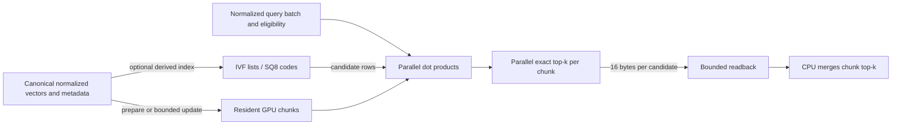

# How Qenlo's GPU search works

The GPU implementation is a custom exact cosine-search kernel in
[`gpu_exact.wgsl`](../crates/qenlo/src/gpu_exact.wgsl), driven by
[`gpu.rs`](../crates/qenlo/src/gpu.rs). wgpu supplies device access, buffer
management, shader compilation and synchronization. It does not supply a vector
index or nearest-neighbor algorithm. USearch is a separate, externally supplied
CPU HNSW implementation; its graph does not run on the GPU.

## From vectors to results

For normalized vectors, cosine distance is `1 - dot(query, vector)`. The score
kernel uses 32 adjacent threads per vector so adjacent threads read adjacent
dimensions. Eight vectors share a 256-thread workgroup. Each thread accumulates
its dimensions and a shared-memory tree reduction combines the 32 partial sums.
Dimensions need not be multiples of 32; missing components contribute zero.
This uses ordinary WGSL workgroup barriers, not an NVIDIA-only warp intrinsic.

Eligibility can come from a CPU membership mask, a compact CPU row list, or a
GPU predicate. The predicate joins optional user equality and timestamp bounds
with AND, and always excludes tombstones. User IDs and timestamps travel as two
32-bit words. Signed timestamp ordering flips the high word's sign bit before
unsigned comparison, preserving the complete signed 64-bit range.

The selection kernel has 256 threads. Each thread scans its stripe once and keeps
its minimum in a register. A tree reduction elects the smallest distance, with the
full unsigned 64-bit ID breaking computed-distance ties. The winner is written to
a candidate buffer and its score invalidated. On the next iteration only the lane
that supplied that winner rescans its stripe; every other lane's minimum remains
valid. Empty slots have a sentinel that the host discards. Selection work is
O(rows + 256 × k) for the reductions plus rescans of at most `ceil(rows / 256)`
items per emitted result, with k bounded to 64.

Only `16 × k` result bytes return per chunk (160 bytes for k=10), not the full
distance array. Adapters with timestamp-query support return another 32 bytes
per chunk for phase diagnostics. The CPU merges the candidate lists. This is
sufficient: an item outside a
chunk's top-k cannot enter the global top-k because that chunk already contains
k better items under the same ordering.

## Limits and costs

Chunk size respects negotiated buffer and dispatch limits, with an additional
131,072-row cap. At 384 dimensions a 100k corpus can fit in one chunk on the
tested adapter. On the measured hybrid Windows host, wgpu enumerates Intel UHD
Graphics (integrated) and NVIDIA GeForce RTX 4050 Laptop GPU (discrete); the
high-performance request selected the NVIDIA adapter for the retained runs, and
the manifest records the actual adapter and API. Each chunk uses a scoring dispatch and a selection dispatch;
an empty compact eligible list needs only the selection dispatch. Every chunk
currently completes readback before the next starts.

Vectors, IDs and metadata stay resident between queries. Query, eligibility,
score, candidate, selection, and staging buffers live in a persistent scratch arena
that grows when a larger batch requires it. Resource bind groups are created with
that arena and reused until it grows, rather than allocated per completed call.
When the adapter supports timestamp queries, the arena also owns a 32-byte
resolve buffer and a 32-byte mapped readback buffer. The query set itself is a
driver object and is not included in the byte total. Allocation admission includes
resident buffers, scores, candidates, readback and conservative transfer staging;
the default budget is 512 MiB. This is tracked buffer allocation, not physical
VRAM residency; driver-private pipeline and bind-group memory is outside the byte
count. Canonical CPU storage and the temporary flattened preparation copy also need
host RAM. Increasing the GPU budget does not solve host memory pressure.

`search_batch` normalizes and uploads up to 128 queries and dispatches them as one
GPU workload. Every response observes the same canonical generation. An optional
deterministic spherical k-means index probes configured posting lists before the
exact kernel. IVF-Flat reranks all probed eligible rows. IVF-SQ8 scores those rows
with per-vector symmetric scalar codes, retains up to `32 × k`, then performs the
same exact FP32 GPU rerank. Canonical vectors remain FP32 and authoritative.

While exact-GPU state is prepared, a deletion changes the owning chunk's host
live mask and an append uploads canonical suffix rows. Appends may create at most
eight extra chunks before the next search consolidates them through full
preparation. Budget failure, device failure, or enabled IVF also uses full
preparation. The collection write lock covers canonical publication and the
derived update, so a search cannot combine generations.

The benchmark times completed API calls, including CPU eligibility, transfer,
dispatch, synchronization, readback and CPU merging. Preparation is separately
reported. On adapters with timestamp-query support, scoring and selection are
also reported from beginning/end timestamps on separate compute passes. Their
sum is device work, not completed-call latency; it excludes queueing, transfer,
synchronization and host merging. Unsupported adapters report both fields as
unavailable. A generation-bound
`EligibilityPlan` performs the default host predicate traversal once and retains
the selected row, mask, or shader-predicate representation and diagnostics.
GPU-required mode returns errors. Automatic mode uses a matching hardware-bound
profile when supplied; otherwise fewer than 4,096 eligible rows route to exact CPU
and larger sets route to GPU, with availability or execution failures falling back.
Reports and benchmark samples retain the routing reason. The static rule remains a
fallback, not a claimed universal crossover or a completed adaptive phase engine.

## What the experiment establishes

The original implementation scored one vector per thread and selected top-k
serially. Cooperative loads, parallel reduction and larger bounded chunks removed
measured bottlenecks. [The retained tuning runs](../benchmarks/2026-08-28/gpu-tuning/)
show broad-scan gains and selective-filter losses on this laptop. Their tiny
query sets are exploratory, not the preregistered scale gate.

GPU and CPU use different floating-point reduction orders. Returned scores are
checked against an independent float64 oracle with absolute tolerance `1e-5`;
the benchmark additionally requires exact paths to return the same IDs except for
a documented boundary tie within `1e-5`; score, filter, count, and uniqueness
checks remain strict. A non-tie mismatch fails explicitly.

The exact mode is brute-force search with bounded top-k output. IVF-Flat and
IVF-SQ8 are approximate candidate generators with explicit recall gates; neither
is a GPU graph index. This does not establish novelty and does not promise a gain at
every selectivity. Physical runtime tests cover this Windows RTX 4050 through
DX12 and Vulkan only. The [real-data result record](results-2026-08-28.md)
shows a 5.14× all-row P95 reduction versus Qenlo exact CPU at 100k × 384, but
also a slower GPU result at 1% selectivity. Linux AMD/Intel/NVIDIA, Metal, mobile,
and browser execution remain package-built but not physically validated here.
